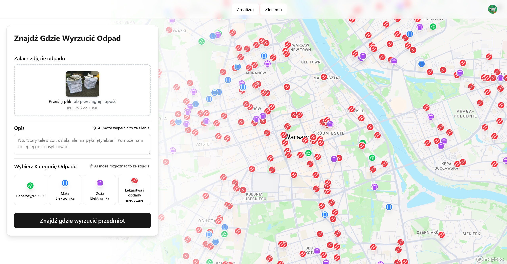

# WyrzućZaMnie

WyrzućZaMnie is a modern web application designed to revolutionize how communities handle special waste disposal. By leveraging Artificial Intelligence and a peer-to-peer model, it connects residents with proper waste collection points and neighbors willing to help with transport.

## Preview




## Features

### AI-Powered Waste Recognition
 Simply upload a photo of your waste. Our integration with **Google Gemini 2.0 Flash** automatically analyzes the image, identifies the object, and assigns it to the correct category (e.g., Bulky Waste, Electronics, Medications).

### Smart Location Services
- **Find Nearest Point**: Instantly locate the closest authorized collection point (PSZOK, pharmacies, e-waste bins) for your specific waste type.
- **Interactive Map**: Visualize collection points and active community jobs on a dynamic map powered by **Mapbox**.

### Community Peer-to-Peer System
- **Delegate**: Can't transport a fridge or old TV yourself? Post a job for others in your community.
- **Claim**: Help neighbors and the environment by picking up their waste on your way to the collection point.

## Tech Stack

### Frontend
-   **Framework**: [Next.js 16](https://nextjs.org/) (App Router)
-   **Library**: [React 19](https://react.dev/)
-   **Styling**: [Tailwind CSS 4](https://tailwindcss.com/)
-   **Components**: [Radix UI](https://www.radix-ui.com/) / [Lucide React](https://lucide.dev/)
-   **Maps**: [Mapbox GL JS](https://www.mapbox.com/) & [React Map GL](https://visgl.github.io/react-map-gl/)

### Backend & Database
-   **Database**: [PostgreSQL](https://www.postgresql.org/) (hosted on [Neon](https://neon.tech/))
-   **ORM**: [Drizzle ORM](https://orm.drizzle.team/)
-   **Auth**: [Clerk](https://clerk.com/)

### AI & Services
-   **AI Model**: [Google Gemini 2.0 Flash](https://deepmind.google/technologies/gemini/) (via Google Gen AI SDK)
-   **Geocoding**: [Geoapify](https://www.geoapify.com/)


## Getting Started

1.  **Clone the repository**
    ```bash
    git clone https://github.com/ramszaj513/bhl-hackaton.git
    cd bhl-hackaton
    ```

2.  **Install dependencies**
    ```bash
    pnpm install
    ```

3.  **Set up environment variables**
    Create a `.env` file based on `.env.example` and add your API keys for Clerk, Neon (Database), Google Gemini, Mapbox, and Geoapify.

4.  **Run the development server**
    ```bash
    pnpm dev
    ```

5.  Open [http://localhost:3000](http://localhost:3000) with your browser.

